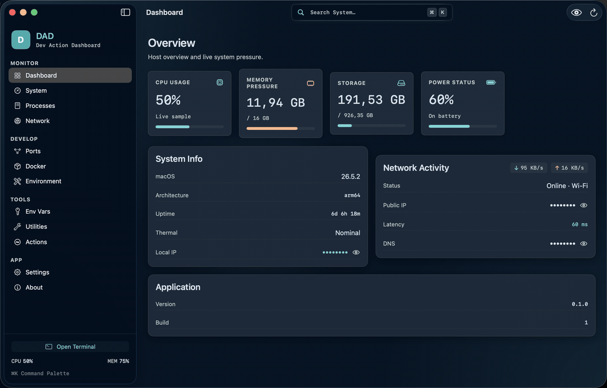
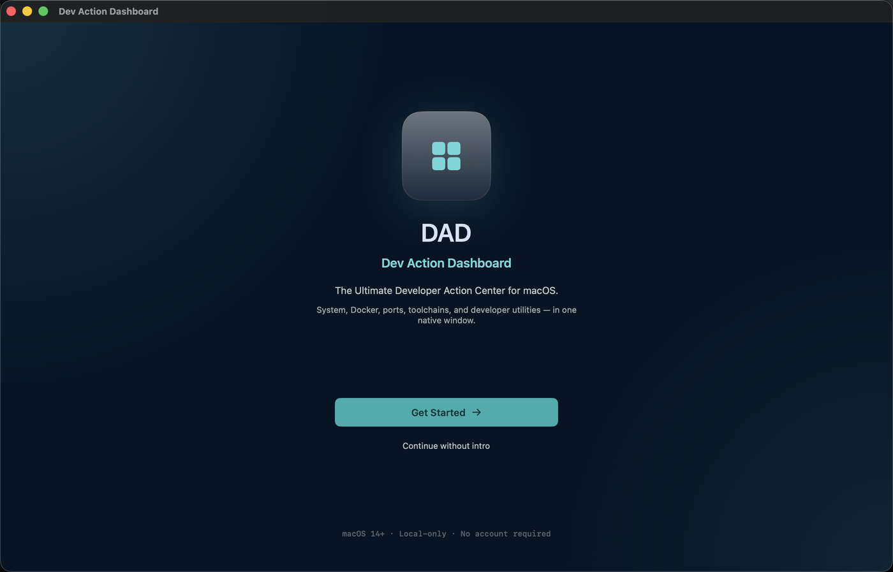
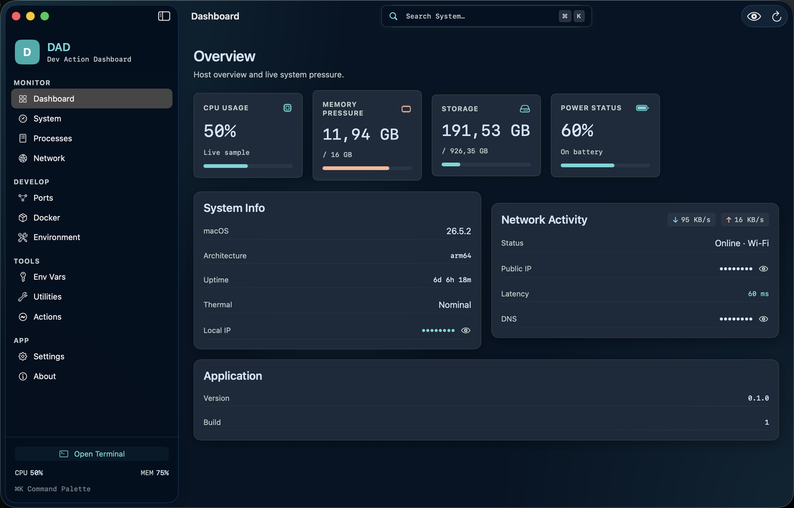
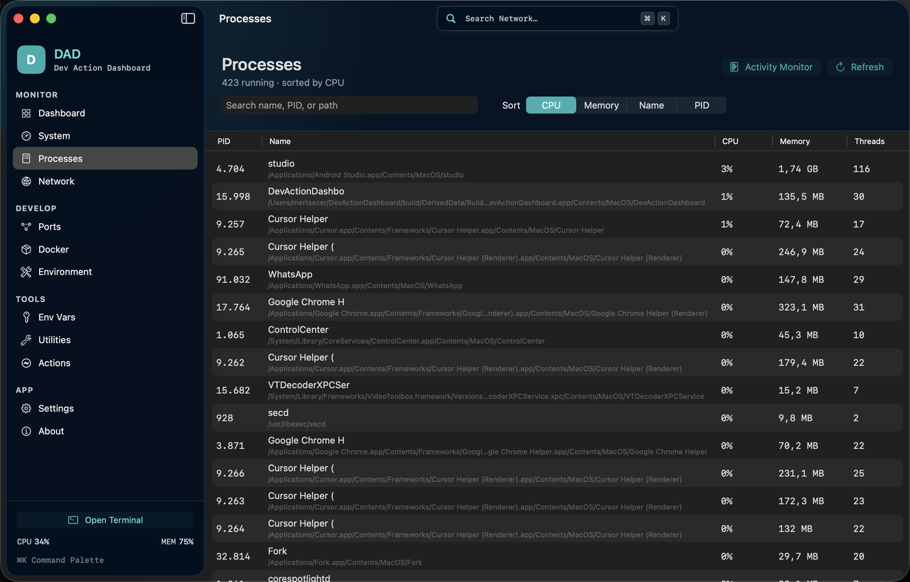
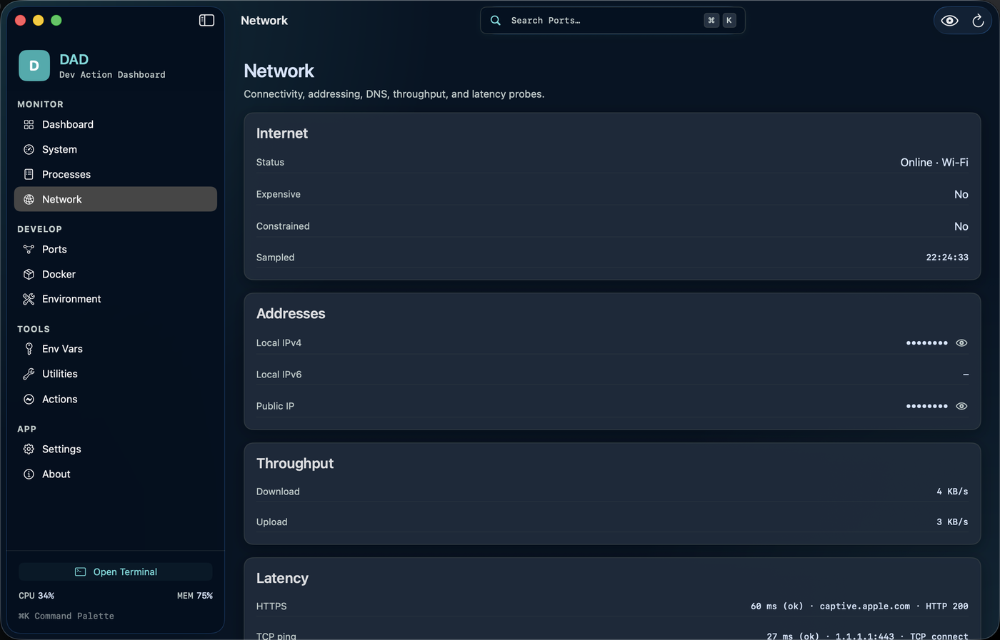
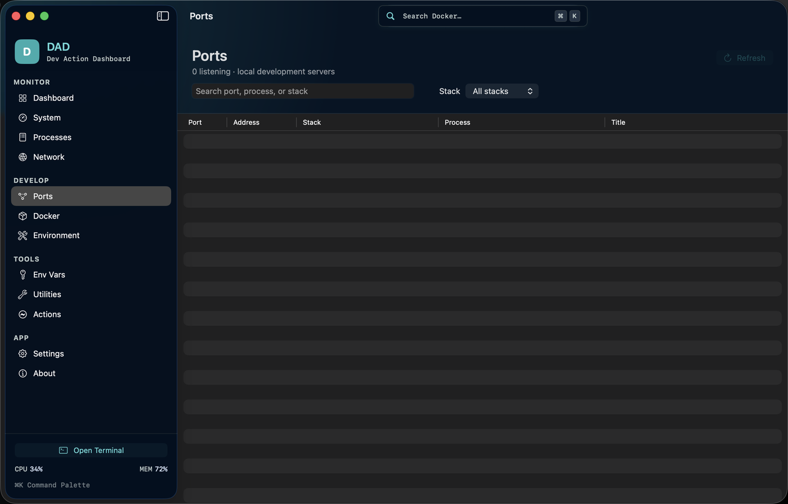
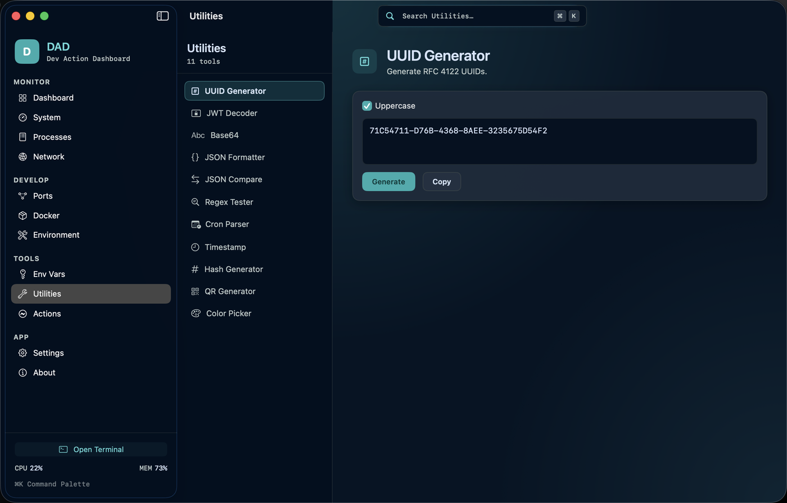
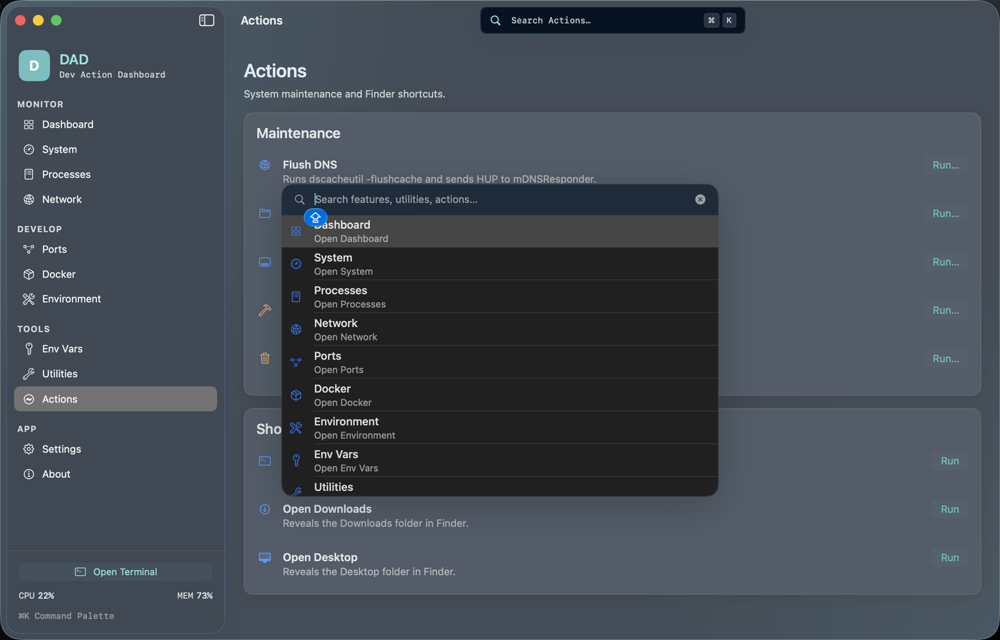
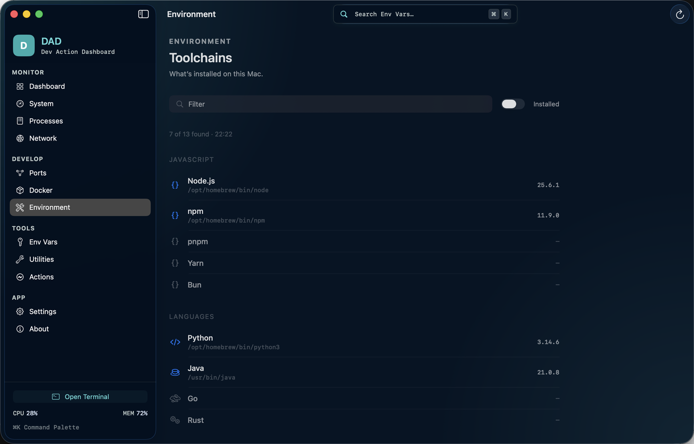
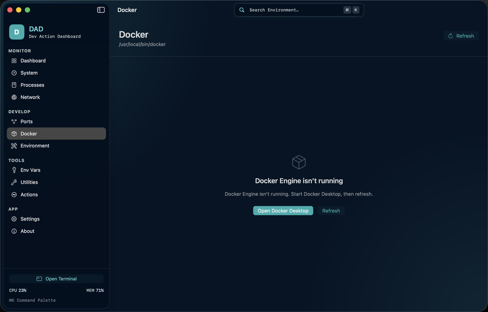

<p align="center">
  
</p>

<h1 align="center">Dev Action Dashboard</h1>

<p align="center">
  <strong>Native macOS control center for day-to-day developer work.</strong><br>
  System metrics, processes, network, ports, Docker, toolchains, and utilities — one window, no account.
</p>

<p align="center">
  <a href="https://github.com/mert-sezer/DevActionDashboard/releases"></a>
  
  
  
</p>

<p align="center">
  
</p>

<p align="center">
  <a href="https://github.com/mert-sezer/DevActionDashboard/releases"><strong>Download DMG</strong></a>
  ·
  <a href="#install-from-dmg">Install notes</a>
  ·
  <a href="#getting-started">Build from source</a>
</p>

---

## What it does

A local-only SwiftUI app for the things you keep bouncing between Activity Monitor, Terminal, Docker Desktop, and a pile of browser tabs.

<p align="center">
  
</p>

| Area | What you get |
| --- | --- |
| **Monitor** | Live CPU, memory, storage, battery, thermal state, and network pressure |
| **Develop** | Listening ports, Docker containers, installed toolchains |
| **Tools** | UUID, JWT, Base64, JSON, regex, cron, hashes, QR, color picker |
| **Actions** | Flush DNS, open common folders, jump to Terminal |
| **Palette** | ⌘K to jump anywhere without leaving the keyboard |

Addresses stay hidden until you choose **Show addresses**.

## Screenshots

<p align="center">
  
  &nbsp;
  
</p>

<p align="center">
  
  &nbsp;
  
</p>

<p align="center">
  
  &nbsp;
  
</p>

<p align="center">
  
  &nbsp;
  
</p>

## Requirements

- macOS 14.0+
- Xcode 16+ to build from source

## Install from DMG

Download the latest `.dmg` from [Releases](https://github.com/mert-sezer/DevActionDashboard/releases). Open it and drag **Dev Action Dashboard** into **Applications**.

Ad-hoc signed builds (the default for this open-source project) are blocked by Gatekeeper until you open the app once with **right-click → Open**. After that, it launches normally.

```bash
shasum -a 256 -c DevActionDashboard-*.sha256
```

A Developer ID signature and Apple notarization remove the Gatekeeper warning. That requires a paid Apple Developer Program membership. Set `CODESIGN_IDENTITY` (and optional notarization secrets) when running `./.github/scripts/package-dmg.sh`. GitHub Actions uses the same values if they are stored as repository secrets.

## Getting started

```bash
git clone https://github.com/mert-sezer/DevActionDashboard.git
cd DevActionDashboard
open DevActionDashboard.xcodeproj
```

Select the **DevActionDashboard** scheme and press ⌘R.

The Xcode project is generated from [`project.yml`](project.yml) with [XcodeGen](https://github.com/yonaskolb/XcodeGen). After changing the source layout:

```bash
brew install xcodegen   # once
./.github/scripts/generate-xcodeproj.sh
```

## Architecture

```text
App/             Composition root and dependency injection
Features/        Isolated feature modules (SwiftUI + ViewModels)
Services/        Use-case facades
Infrastructure/  System, Docker, network, and process adapters
Core/            Protocols, models, errors, logging
Shared/          Design tokens and reusable UI
```

Features do not import other features. The sidebar is assembled from `FeatureRegistry`.

See [Documentation/Architecture.md](Documentation/Architecture.md) for details.

## Contributing

See [CONTRIBUTING.md](CONTRIBUTING.md) and the [Code of Conduct](CODE_OF_CONDUCT.md).

## Security

See [SECURITY.md](SECURITY.md).

## License

[MIT](LICENSE) © 2026 Mert Sezer
