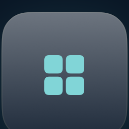

<p align="center">
  
</p>

<h1 align="center">Dev Action Dashboard</h1>

<p align="center">
  <strong>Native macOS control center for day-to-day developer work.</strong><br>
  System metrics, processes, network, ports, Docker, toolchains, and utilities — in one window.
</p>

<p align="center">
  
  
  
  
</p>

<p align="center">
  
</p>

<p align="center">
  <a href="https://github.com/mert-sezer/DevActionDashboard/releases/latest"><strong>Download DMG</strong></a>
  ·
  <a href="#install">Install</a>
  ·
  <a href="#features">Features</a>
  ·
  <a href="#architecture">Architecture</a>
</p>

---

## Features

Press **⌘K** anywhere to jump to a feature, utility, or action.

<p align="center">
  
</p>

<p align="center">
  
  &nbsp;
  
</p>

<p align="center">
  
  &nbsp;
  
</p>

<p align="center">
  
  &nbsp;
  
</p>

- **Dashboard** — live CPU, memory, storage, power, and network, with IP addresses hidden until you reveal them
- **Processes** — search, sort, and jump to Activity Monitor
- **Network** — connectivity, throughput, latency, DNS
- **Ports** — local listeners and stack detection, open in the browser
- **Docker** — containers when the engine is running
- **Environment** — Node, Python, Java, and other toolchains on this Mac
- **Utilities** — UUID, JWT, Base64, JSON, regex, cron, timestamps, hashes, QR, color picker
- **Actions** — flush DNS, empty trash, open common folders
- **Menu bar extra** — CPU, memory, and storage at a glance

## Install

Download the latest `.dmg` from [Releases](https://github.com/mert-sezer/DevActionDashboard/releases). Open it and drag **Dev Action Dashboard** into **Applications**.

Ad-hoc signed builds (the default for this open-source project) are blocked by Gatekeeper until you open the app once with **right-click → Open**. After that, it launches normally.

```bash
shasum -a 256 -c DevActionDashboard-*.sha256
```

A Developer ID signature and Apple notarization remove the Gatekeeper warning. That requires a paid Apple Developer Program membership. Set `CODESIGN_IDENTITY` (and optional notarization secrets) when running `./Scripts/package-dmg.sh`.

## Build from source

Requires **macOS 14+** and **Xcode 16+**.

```bash
git clone https://github.com/mert-sezer/DevActionDashboard.git
cd DevActionDashboard
open DevActionDashboard.xcodeproj
```

Select the **DevActionDashboard** scheme and press ⌘R.

The Xcode project is generated from [`project.yml`](project.yml) with [XcodeGen](https://github.com/yonaskolb/XcodeGen). After changing the source layout:

```bash
brew install xcodegen   # once
./Scripts/generate-xcodeproj.sh
```

## Architecture

```text
App/             Composition root and dependency injection
Features/        Isolated feature modules (SwiftUI + ViewModels)
Services/        Use-case facades
Infrastructure/  System, Docker, network, and process adapters
Core/            Protocols, models, errors, logging
Shared/          Design tokens and reusable UI
```

Features do not import other features. The sidebar is assembled from `FeatureRegistry`.

See [Documentation/Architecture.md](Documentation/Architecture.md) for details.

## Contributing

See [CONTRIBUTING.md](CONTRIBUTING.md) and the [Code of Conduct](CODE_OF_CONDUCT.md).

## Security

See [SECURITY.md](SECURITY.md). The app stays on-device. Addresses on Dashboard and Network are masked until you choose to show them.

## License

[MIT](LICENSE) © 2026 Mert Sezer
